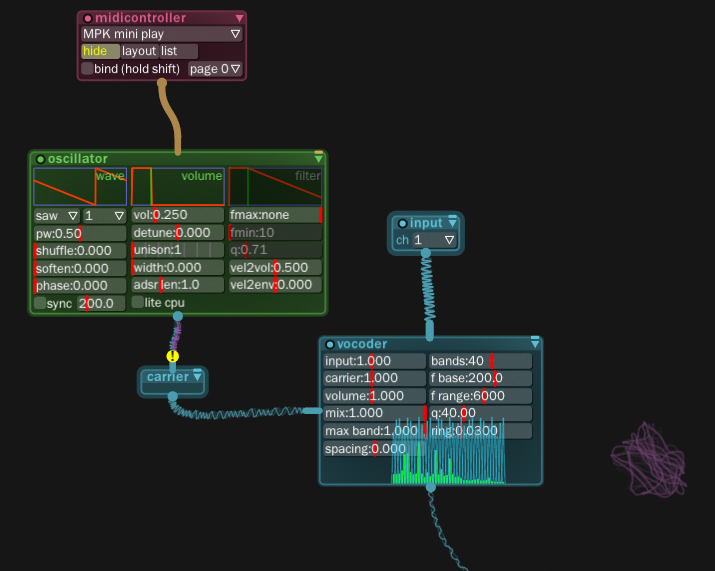

# Using vocoder

you need these modules:

- `input` for your microphone input
- your `oscillator` (or VST plugin) to feed your synth audio into `vocodercarrier`, which turns it into carrier signal
- `vocoder` or `fftvocoder` itself

Vocoder needs to be connected both to `input` and `vocodercarrier` modules.

Enjoy your robot voice!
 

